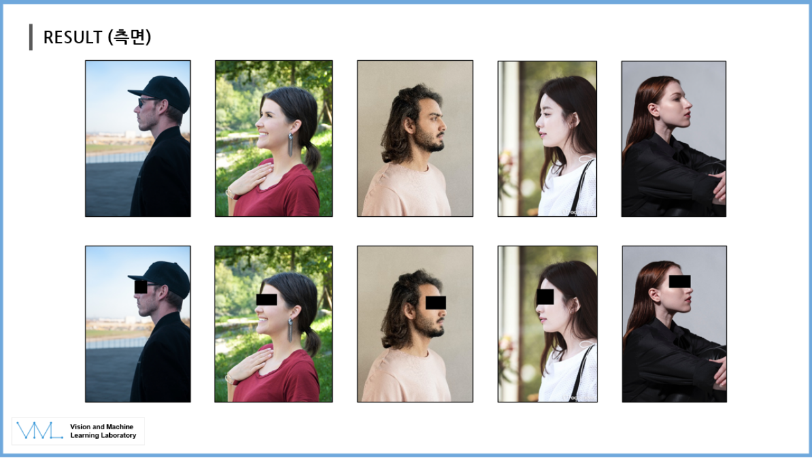

# Person De-Identification


## Prerequisites
- [Python 3.8.8](https://www.python.org/)
- [Pytorch 1.7.1](https://pytorch.org/get-started/locally/)
- [PyQT](https://pypi.org/project/PyQt5/)
- [PyInstaller](https://pyinstaller.org/en/stable/)

## Installation
We used following instructions to install Pytorch.
```
conda install pytorch==1.7.1 torchvision==0.8.2 torchaudio==0.7.2 cudatoolkit=11.0 -c pytorch
```

## Testing
To test our Person De-Identification program, test it with following instruction.
```
python ui.py
```

Also, if you build `program.spec` as a pyinstaller, you can run our Person De-Identificaiton with the `exe` executor.
```
pyinstaller --onefile program.spec
```


## Result

(일반 노트북) : Intel i5-1135G7
- 3.5초 (per image)

(연구실 컴퓨터) : Intel i7-10700K 
- 1.15초 (per image)

